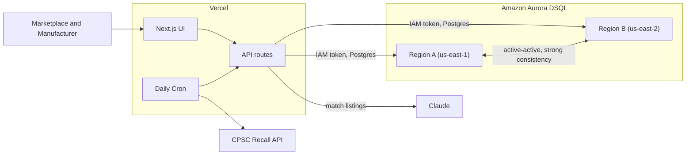

# SafeState

Recalls, made executable. SafeState turns a product recall from a notice into a rule that a sale has to pass. When a secondhand product is listed or bought, the marketplace checks SafeState, and a recalled unit is blocked at the moment of resale, down to the serial number, while safe units still sell.

Built for the H0: Hack the Zero Stack hackathon, on Amazon Aurora DSQL and Vercel.

- Live demo: https://safestate.vercel.app
- Architecture: [docs/architecture.md](docs/architecture.md)
- Design decisions: [docs/adr](docs/adr)

## The problem

A recall today is just information. It sits on a web page and waits to be read. On the secondhand market the buyer was never on any mailing list, so the recall and the sale never meet. SafeState makes them meet: at listing or checkout the marketplace asks whether this exact unit is safe to sell, and a recalled unit is blocked in real time.

## Architecture



The full request flow and the concurrency guarantee are in [docs/architecture.md](docs/architecture.md).

## Why Aurora DSQL

The whole product rests on one promise: the instant a recall is committed in any region, no marketplace anywhere can read that product as safe again. That is a strong consistency problem. DSQL's active-active, multi-region design with strong reads closes the window where a recalled item would otherwise still look safe.

To make the guarantee hold under load, a recall and a sale of the same model are made to write the same guard row. DSQL uses optimistic concurrency, so the two transactions collide, one wins, and the loser retries on `SQLSTATE 40001`, reads the recalled state, and blocks the sale. A recalled unit never slips through. See [ADR-0002](docs/adr/0002-guard-row-conflict.md).

## Tech stack

- Next.js (App Router) on Vercel
- Amazon Aurora DSQL, multi-region (us-east-1, us-east-2, witness us-west-2)
- node-postgres with IAM token auth (`@aws-sdk/dsql-signer`)
- Vercel Cron for daily CPSC ingestion
- Claude for listing-to-recall matching
- TypeScript and Tailwind CSS

## Run locally

```bash
npm install
npm run dev
```

Open http://localhost:3000. Set the database connection using the variables in `.env.example`. Local development uses your default AWS credential chain, see [ADR-0003](docs/adr/0003-iam-token-auth.md) and [ADR-0004](docs/adr/0004-vercel-credential-naming.md).

## Tests

```bash
npm test
```

## Documentation

- [docs/architecture.md](docs/architecture.md) covers how the pieces fit and the concurrency guarantee.
- [docs/adr](docs/adr) records the key design decisions and why they were made.

---

Built for the H0: Hack the Zero Stack hackathon.
