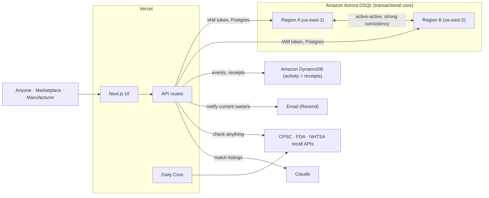

# SafeState

Recalls, made executable. SafeState turns a product recall from a notice into a rule that a sale has to pass. When a secondhand product is listed or bought, the marketplace checks SafeState, and a recalled unit is blocked at the moment of resale, down to the serial number, while safe units still sell. The same engine lets anyone check any product, and warns the people who already own a recalled one.

Built for the H0: Hack the Zero Stack hackathon, on Amazon Aurora DSQL, Amazon DynamoDB, and Vercel.

- Live demo: https://safestate.vercel.app
- Architecture: [docs/architecture.md](docs/architecture.md)
- API: [docs/api.md](docs/api.md)
- Design decisions: [docs/adr](docs/adr)

## The problem

A recall today is just information. It sits on a web page and waits to be read. On the secondhand market the buyer was never on any mailing list, so the recall and the sale never meet. SafeState makes them meet: at listing or checkout the marketplace asks whether this exact unit is safe to sell, and a recalled unit is blocked in real time. And the recall reaches the people who already own one.

## What's inside

- **Marketplace Gate** - authorizes or blocks a sale in real time, precise to the serial number.
- **Recall Exposure Scan** - checks a whole catalog at once and reports its recall exposure.
- **Is it recalled? (public check)** - search any product, food, drug, or vehicle across the live CPSC, FDA, and NHTSA databases.
- **Safe Handoff** - a public, per-unit check for peer-to-peer sales, with a shareable link, a QR code, and a durable receipt.
- **Manufacturer Console** - issue a recall by model, lot, serial range, or a single unit. It notifies the current owners by email.
- **Live Consistency Lab** - run the cross-region read, a real optimistic-concurrency race, and a 100-way concurrent load test against the live cluster.
- **Safety Passport, Recalls feed, AI Match, and a Developer API** - per-unit history, the real CPSC feed, Claude-powered listing matching, and a drop-in API with an embeddable verdict badge.

## Architecture



The full request flow and the concurrency guarantee are in [docs/architecture.md](docs/architecture.md).

## Why Aurora DSQL

The whole product rests on one promise: the instant a recall is committed in any region, no marketplace anywhere can read that product as safe again. That is a strong consistency problem. DSQL's active-active, multi-region design with strong reads closes the window where a recalled item would otherwise still look safe.

To make the guarantee hold under load, a recall and a sale of the same model are made to write the same guard row. DSQL uses optimistic concurrency, so the two transactions collide, one wins, and the loser retries on `SQLSTATE 40001`, reads the recalled state, and blocks the sale. A recalled unit never slips through. See [ADR-0002](docs/adr/0002-guard-row-conflict.md).

DSQL was chosen over Aurora PostgreSQL and DynamoDB deliberately, because it is the only one of the three with multi-region, active-active strong consistency. The reasoning is in [ADR-0007](docs/adr/0007-why-dsql-over-alternatives.md).

## Two databases, on purpose

Aurora DSQL is the primary database and owns every transactional safety decision. Amazon DynamoDB owns the high-volume, append-only activity firehose (checks, verifies, scans, decisions), the live counters, and the durable Safety Receipts. That workload does not need a distributed transaction, so it sits on the database that fits it. See [ADR-0008](docs/adr/0008-dynamodb-activity-firehose.md).

## Correctness under load

The Live lab runs a stress test against the live cluster: 100 concurrent attempts to buy a recalled unit. Every attempt is blocked, and zero recalled units sell, no matter the concurrency. The optimistic-concurrency race is genuine, run in parallel, so the winner varies from run to run.

## Tech stack

- Next.js (App Router) on Vercel
- Amazon Aurora DSQL, multi-region (us-east-1, us-east-2, witness us-west-2) - transactional core
- Amazon DynamoDB - activity firehose, counters, and durable receipts
- node-postgres with IAM token auth (`@aws-sdk/dsql-signer`); `@aws-sdk/lib-dynamodb` for DynamoDB
- Vercel Cron for daily CPSC ingestion; live search across CPSC, FDA, and NHTSA
- Claude for listing-to-recall matching; Resend for owner notifications
- TypeScript and Tailwind CSS

## Run locally

```bash
npm install
npm run dev
```

Open http://localhost:3000. Set the connection and optional keys using the variables in `.env.example`. Local development uses your default AWS credential chain, see [ADR-0003](docs/adr/0003-iam-token-auth.md) and [ADR-0004](docs/adr/0004-vercel-credential-naming.md).

## Tests

```bash
npm test
```

## Documentation

- [docs/architecture.md](docs/architecture.md) covers how the pieces fit and the concurrency guarantee.
- [docs/api.md](docs/api.md) is the integration surface: the catalog scan, the single-unit gate, the public check, and the embeddable badge.
- [docs/adr](docs/adr) records the key design decisions and why they were made.

---

Built for the H0: Hack the Zero Stack hackathon.
