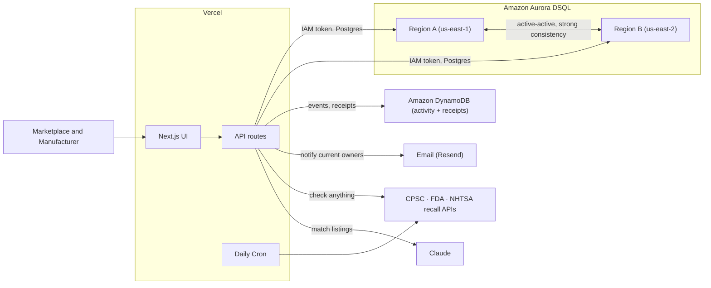
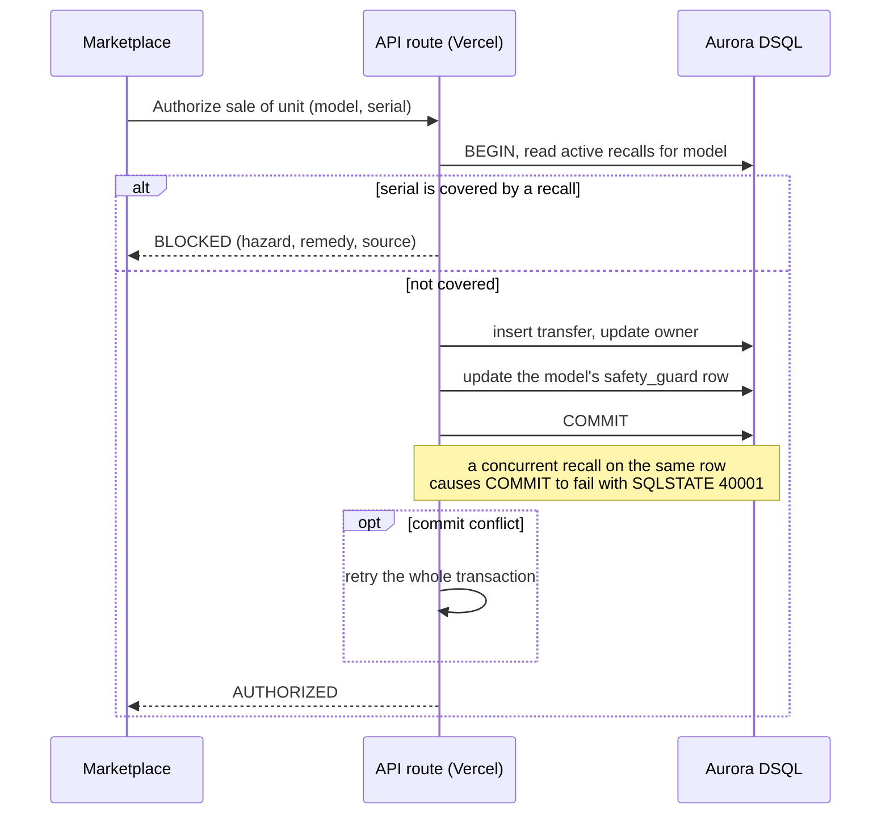

# Architecture

SafeState is a Next.js app on Vercel with Amazon Aurora DSQL as the primary database. The goal of the design is one guarantee: the moment a recall is committed in any region, no marketplace in any region can ever read that product as safe again.

## Components

- **UI** (Next.js, on Vercel): the Gate, the public Check, Safe Handoff (Verify), the Scan, the Console, the Passport, the Live lab, the Recalls feed, the Match assistant, and the Developer API page.
- **API routes** (Next.js route handlers, on Vercel): the safety decision, recall publishing, the bulk catalog scan, the public multi-source check, durable receipts, owner notifications, and data reads. They connect to DSQL over the Postgres protocol using short-lived IAM tokens.
- **Daily Cron** (Vercel Cron): ingests real recalls from the public CPSC API once a day. The public check also queries CPSC, FDA, and NHTSA live.
- **Aurora DSQL**: a multi-region, active-active cluster in us-east-1 and us-east-2 with a witness in us-west-2. Owns all transactional safety state.
- **DynamoDB**: the append-only activity firehose (checks, verifies, scans, decisions), the live counters, and the durable Safety Receipts. A different workload that does not need a distributed transaction. See [ADR-0008](adr/0008-dynamodb-activity-firehose.md).
- **Claude**: maps free-text secondhand listings to the right recall, with a confidence score.
- **Email (Resend)**: when a recall is issued, the current owners of affected units are notified.

## System diagram

## Two databases, on purpose

Aurora DSQL is the primary database and owns every transactional safety decision, where strong cross-region consistency is the product. DynamoDB owns the high-volume, append-only activity stream (checks, verifies, scans, decisions), the live counters, and the durable Safety Receipts. That workload is write-heavy, key-accessed, and does not need a distributed transaction. Each workload sits on the database that fits it. See [ADR-0008](adr/0008-dynamodb-activity-firehose.md).

## The safety decision

The heart of the app is "authorize a transfer". A marketplace asks whether a specific unit (model plus serial) can be sold. The decision runs in one transaction.

## The concurrency guarantee

DSQL uses snapshot isolation with optimistic concurrency. It detects write-write conflicts at commit time, but snapshot isolation does not stop write skew: two transactions that touch different rows can both succeed even if, together, they break a rule.

A recall and a sale naturally touch different rows, so without help they could both commit and a recalled unit could still sell. To prevent that, every model has a single `safety_guard` row. Both the recall path and the authorize-sale path write that row, which forces DSQL to treat them as a real conflict. One commits, the other fails with `SQLSTATE 40001` (`OC000`), and the loser retries the whole transaction. On retry it reads the now-recalled state and returns BLOCKED. See [ADR-0002](adr/0002-guard-row-conflict.md).

## Multi-region

The cluster is peered across us-east-1 and us-east-2, both active for reads and writes, with a witness in us-west-2 that holds the log for quorum but serves no application traffic. A recall written through one region's endpoint is immediately readable from the other. The Live lab page lets you run this yourself against the live cluster.

## Correctness under load

The Live lab fires 100 concurrent sale attempts at a recalled unit against the live cluster. Every attempt must be blocked, and zero recalled units may sell, regardless of concurrency. The optimistic-concurrency race runs the two transactions in genuine parallel, so the winner varies from run to run.

## Checking any product (CPSC, FDA, NHTSA)

The public check is not limited to the registry. It searches three live federal databases at once: CPSC for consumer products, FDA for food, drugs, and cosmetics, and NHTSA for vehicles. A vehicle query (make, model, year) is routed to NHTSA only; everything else fans out to CPSC and FDA in parallel. Each source is best-effort, so one being slow never blocks the others.

## Reaching the owner

When a recall is issued, SafeState walks live ownership to find the current owners of affected units, not just the original buyers, and notifies them. Notifications are best-effort and never block the recall: a real email is sent when an email provider is configured, and every dispatch is recorded either way.

## Data model

The full schema lives in [db/migrations](../db/migrations): [001_init.sql](../db/migrations/001_init.sql) for the core tables and [002_cpsc.sql](../db/migrations/002_cpsc.sql) for the recall feed. The central tables:

- `product_models`, `product_instances` - the catalog and individual units (with serials).
- `safety_guard` - exactly one row per model, holding the safety status and epoch. This is the row both a recall and a sale write, which is what forces DSQL to detect their conflict.
- `safety_directives` and `directive_targets` - a recall or repair order and the scope it covers (whole model, a lot, a serial range, or a single unit).
- `ownership_transfers` and `transfer_attempts` - the record of each sale and an idempotency key per attempt.
- `cpsc_recalls` - the real recall feed ingested from CPSC.

Activity events and durable Safety Receipts live in Amazon DynamoDB, not in DSQL. See [Two databases, on purpose](#two-databases-on-purpose).

## Data, auth, and constraints

- **Auth**: the database has no password. Each connection mints a short-lived IAM token with `@aws-sdk/dsql-signer`. See [ADR-0003](adr/0003-iam-token-auth.md).
- **IDs**: DSQL has no sequences, so primary keys are UUIDs generated in code. See [ADR-0005](adr/0005-uuids-no-foreign-keys.md).
- **Relationships**: DSQL has no foreign keys, so integrity is enforced in the application. See [ADR-0005](adr/0005-uuids-no-foreign-keys.md).
- **Schema changes**: DSQL allows one DDL statement per transaction, so migrations run one statement at a time.

## Decisions

The reasoning behind these choices is recorded as ADRs in [docs/adr](adr).
